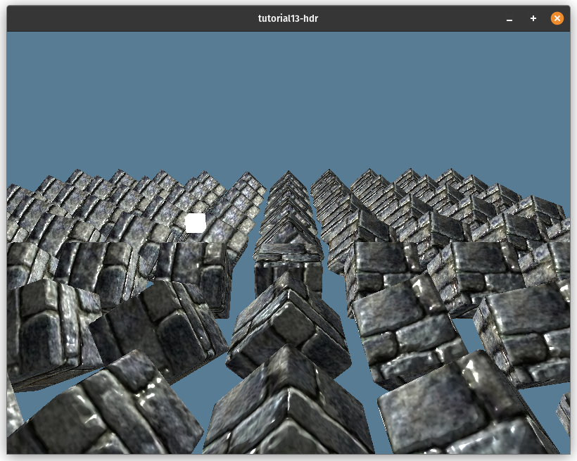
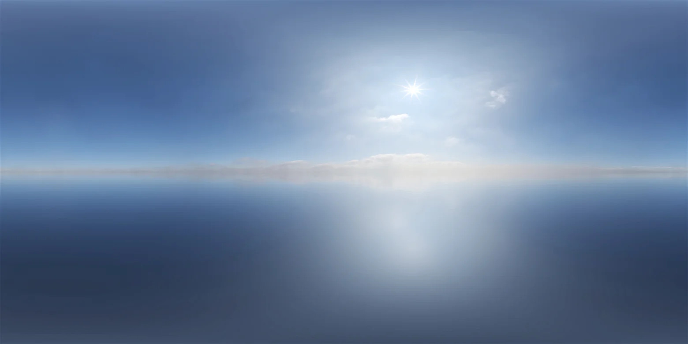

# High Dynamic Range Rendering

Up to this point we've been using the sRGB colorspace to render our scene.
While this is fine it limits what we can do with our lighting. We are using
`TextureFormat::Bgra8UnormSrgb` (on most systems) for our surface texture.
This means that we have 8bits for each of the color and alpha channels. While
the channels are stored as integers between 0 and 255 inclusively, they get
converted to and from floating point values between 0.0 and 1.0. The TL:DR of
this is that using 8bit textures we only get 256 possible values in each
channel.

The kicker with this is most of the precision gets used to represent darker
values of the scene. This means that bright objects like a light bulb have
the same value as exeedingly bright objects such as the sun. This inaccuracy
makes realistic lighting difficult to do right. Because of this, we are going
to switch our rendering system to use high dynamic range in order to give our
scene more flexibility and enable use to leverage more advanced techniques
such as Physically Based Rendering.

## What is High Dynamic Range?

In laymans terms, a High Dynamic Range texture is a texture with more bits
per pixel. In addition to this, HDR textures are stored as floating point values
instead of integer values. This means that the texture can have brightness values
greater than 1.0 meaning you can have a dynamic range of brighter objects.

## Switching to HDR

As of writing, wgpu doesn't allow us to use a floating point format such as
`TextureFormat::Rgba16Float` (not all monitors support that anyways), so we
will have to render our scene in an HDR format, then convert the values to a
supported format such as `TextureFormat::Bgra8UnormSrgb` using a technique
called tonemapping.

Before we do that though we need to switch to using an HDR texture for rendering.

To start we'll create a file called `hdr.rs` and put the some code in it:

```rust
use wgpu::Operations;

use crate::{create_render_pipeline, texture};

/// Owns the render texture and controls tonemapping
pub struct HdrPipeline {
    pipeline: wgpu::RenderPipeline,
    bind_group: wgpu::BindGroup,
    texture: texture::Texture,
    width: u32,
    height: u32,
    format: wgpu::TextureFormat,
    layout: wgpu::BindGroupLayout,
}

impl HdrPipeline {
    pub fn new(device: &wgpu::Device, config: &wgpu::SurfaceConfiguration) -> Self {
        let width = config.width;
        let height = config.height;

        // We could use `Rgba32Float`, but that requires some extra
        // features to be enabled for rendering.
        let format = wgpu::TextureFormat::Rgba16Float;

        let texture = texture::Texture::create_2d_texture(
            device,
            width,
            height,
            format,
            wgpu::TextureUsages::TEXTURE_BINDING | wgpu::TextureUsages::RENDER_ATTACHMENT,
            wgpu::FilterMode::Nearest,
            Some("Hdr::texture"),
        );

        let layout = device.create_bind_group_layout(&wgpu::BindGroupLayoutDescriptor {
            label: Some("Hdr::layout"),
            entries: &[
                // This is the HDR texture
                wgpu::BindGroupLayoutEntry {
                    binding: 0,
                    visibility: wgpu::ShaderStages::FRAGMENT,
                    ty: wgpu::BindingType::Texture {
                        sample_type: wgpu::TextureSampleType::Float { filterable: true },
                        view_dimension: wgpu::TextureViewDimension::D2,
                        multisampled: false,
                    },
                    count: None,
                },
                wgpu::BindGroupLayoutEntry {
                    binding: 1,
                    visibility: wgpu::ShaderStages::FRAGMENT,
                    ty: wgpu::BindingType::Sampler(wgpu::SamplerBindingType::Filtering),
                    count: None,
                },
            ],
        });
        let bind_group = device.create_bind_group(&wgpu::BindGroupDescriptor {
            label: Some("Hdr::bind_group"),
            layout: &layout,
            entries: &[
                wgpu::BindGroupEntry {
                    binding: 0,
                    resource: wgpu::BindingResource::TextureView(&texture.view),
                },
                wgpu::BindGroupEntry {
                    binding: 1,
                    resource: wgpu::BindingResource::Sampler(&texture.sampler),
                },
            ],
        });

        // We'll cover the shader next
        let shader = wgpu::include_wgsl!("hdr.wgsl");
        let pipeline_layout = device.create_pipeline_layout(&wgpu::PipelineLayoutDescriptor {
            label: None,
            bind_group_layouts: &[&layout],
            push_constant_ranges: &[],
        });

        let pipeline = create_render_pipeline(
            device,
            &pipeline_layout,
            config.format,
            None,
            // We'll use some math to generate the vertex data in
            // the shader, so we don't need any vertex buffers
            &[],
            wgpu::PrimitiveTopology::TriangleList,
            shader,
        );

        Self {
            pipeline,
            bind_group,
            layout,
            texture,
            width,
            height,
            format,
        }
    }

    /// Resize the HDR texture
    pub fn resize(&mut self, device: &wgpu::Device, width: u32, height: u32) {
        self.texture = texture::Texture::create_2d_texture(
            device,
            width,
            height,
            wgpu::TextureFormat::Rgba16Float,
            wgpu::TextureUsages::TEXTURE_BINDING | wgpu::TextureUsages::RENDER_ATTACHMENT,
            wgpu::FilterMode::Nearest,
            Some("Hdr::texture"),
        );
        self.bind_group = device.create_bind_group(&wgpu::BindGroupDescriptor {
            label: Some("Hdr::bind_group"),
            layout: &self.layout,
            entries: &[
                wgpu::BindGroupEntry {
                    binding: 0,
                    resource: wgpu::BindingResource::TextureView(&self.texture.view),
                },
                wgpu::BindGroupEntry {
                    binding: 1,
                    resource: wgpu::BindingResource::Sampler(&self.texture.sampler),
                },
            ],
        });
        self.width = width;
        self.height = height;
    }

    /// Exposes the HDR texture
    pub fn view(&self) -> &wgpu::TextureView {
        &self.texture.view
    }

    /// The format of the HDR texture
    pub fn format(&self) -> wgpu::TextureFormat {
        self.format
    }

    /// This renders the internal HDR texture to the [TextureView]
    /// supplied as parameter.
    pub fn process(&self, encoder: &mut wgpu::CommandEncoder, output: &wgpu::TextureView) {
        let mut pass = encoder.begin_render_pass(&wgpu::RenderPassDescriptor {
            label: Some("Hdr::process"),
            color_attachments: &[Some(wgpu::RenderPassColorAttachment {
                view: &output,
                resolve_target: None,
                ops: Operations {
                    load: wgpu::LoadOp::Load,
                    store: true,
                },
            })],
            depth_stencil_attachment: None,
        });
        pass.set_pipeline(&self.pipeline);
        pass.set_bind_group(0, &self.bind_group, &[]);
        pass.draw(0..3, 0..1);
    }
}
```

You may have noticed that we added a new parameter to `create_render_pipeline`. Here a the changes to that function:

```rust
fn create_render_pipeline(
    device: &wgpu::Device,
    layout: &wgpu::PipelineLayout,
    color_format: wgpu::TextureFormat,
    depth_format: Option<wgpu::TextureFormat>,
    vertex_layouts: &[wgpu::VertexBufferLayout],
    topology: wgpu::PrimitiveTopology, // NEW!
    shader: wgpu::ShaderModuleDescriptor,
) -> wgpu::RenderPipeline {
    let shader = device.create_shader_module(shader);

    device.create_render_pipeline(&wgpu::RenderPipelineDescriptor {
        // ...
        primitive: wgpu::PrimitiveState {
            topology, // NEW!
            // ...
        },
        // ...
    })
}
```

## Tonemapping

The process of tonemapping is taking an HDR image and converting it to
a Standard Dynamic Range (SDR) which is usually sRGB. The exact
tonemapping curve you uses is ultimately up to your artistic needs, but
for this tutorial we'll use a popular one know as the Academy Color
Encoding System or ACES used throughout the game industry as well as the film industry.

With that let's jump into the the shader. Create a file called `hdr.wgsl`
and add the following code:

```wgsl
// Maps HDR values to linear values
// Based on http://www.oscars.org/science-technology/sci-tech-projects/aces
fn aces_tone_map(hdr: vec3<f32>) -> vec3<f32> {
    let m1 = mat3x3(
        0.59719, 0.07600, 0.02840,
        0.35458, 0.90834, 0.13383,
        0.04823, 0.01566, 0.83777,
    );
    let m2 = mat3x3(
        1.60475, -0.10208, -0.00327,
        -0.53108,  1.10813, -0.07276,
        -0.07367, -0.00605,  1.07602,
    );
    let v = m1 * hdr;
	let a = v * (v + 0.0245786) - 0.000090537;
	let b = v * (0.983729 * v + 0.4329510) + 0.238081;
    return clamp(m2 * (a / b), vec3(0.0), vec3(1.0));
}

struct VertexOutput {
    @location(0) uv: vec2<f32>,
    @builtin(position) clip_position: vec4<f32>,
};

@vertex
fn vs_main(
    @builtin(vertex_index) vi: u32,
) -> VertexOutput {
    var out: VertexOutput;
    // Generate a triangle that covers the whole screen
    out.uv = vec2<f32>(
        f32((vi << 1u) & 2u),
        f32(vi & 2u),
    );
    out.clip_position = vec4<f32>(out.uv * 2.0 - 1.0, 0.0, 1.0);
    // We need to invert the y coordinate so the image
    // is not upside down
    out.uv.y = 1.0 - out.uv.y;
    return out;
}

@group(0)
@binding(0)
var hdr_image: texture_2d<f32>;

@group(0)
@binding(1)
var hdr_sampler: sampler;

@fragment
fn fs_main(vs: VertexOutput) -> @location(0) vec4<f32> {
    let hdr = textureSample(hdr_image, hdr_sampler, vs.uv);
    let sdr = aces_tone_map(hdr.rgb);
    return vec4(sdr, hdr.a);
}
```

With those in place we can start using our HDR texture in our core
render pipeline. First we need to add the new `HdrPipeline` to `State`:

```rust
// lib.rs

mod hdr; // NEW!

// ...

struct State {
    // ...
    // NEW!
    hdr: hdr::HdrPipeline,
}

impl State {
    pub fn new(window: Window) -> anyhow::Result<Self> {
        // ...
        // NEW!
        let hdr = hdr::HdrPipeline::new(&device, &config);

        // ...

        Self {
            // ...
            hdr, // NEW!
        }
    }
}
```

Then when we resize the window, we need to call `resize()` on our
`HdrPipeline`:

```rust
fn resize(&mut self, new_size: winit::dpi::PhysicalSize<u32>) {
    // UPDATED!
    if new_size.width > 0 && new_size.height > 0 {
        // ...
        self.hdr
            .resize(&self.device, new_size.width, new_size.height);
        // ...
    }
}
```

Next in `render()` we need to switch the `RenderPass` to use our HDR
texture instead of the surface texture:

```rust
// render()
let mut render_pass = encoder.begin_render_pass(&wgpu::RenderPassDescriptor {
    label: Some("Render Pass"),
    color_attachments: &[Some(wgpu::RenderPassColorAttachment {
        view: self.hdr.view(), // UPDATED!
        resolve_target: None,
        ops: wgpu::Operations {
            load: wgpu::LoadOp::Clear(wgpu::Color {
                r: 0.1,
                g: 0.2,
                b: 0.3,
                a: 1.0,
            }),
            store: true,
        },
    })],
    depth_stencil_attachment: Some(
        // ...
    ),
});
```

Finally after we draw all the objects in the frame we can run our
tonemapper with the surface texture as the output:

```rust
// NEW!
// Apply tonemapping
self.hdr.process(&mut encoder, &view);
```

It's a pretty easy switch. Here's the image before using HDR:



Here's what it looks like after implementing HDR:


## Loading HDR textures

## Equirectangular textures and cube maps



## Compute shaders

## Skybox


## Reflections

